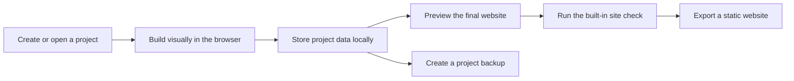

<h1 align="center">☀️ sunConstructor</h1>

<p align="center">
  <strong>A visual website builder that works entirely in your browser, keeps every project on your own device, and lets you create, refine and export complete static websites without accounts, servers or a backend.</strong>
</p>

<p align="center">
  
  
  
</p>

---

## About sunConstructor

sunConstructor is a visual website builder created for people who want to make a personal website, portfolio, landing page or small-business site without learning specialist design tools, setting up a backend or creating yet another online account. You start by giving the project a name and choosing a direction, then build the page directly on a live canvas, adjust typography, colours, spacing and layout until the result feels like your own, and finally keep the entire project on your device as a portable backup or export it as a finished static website that can be uploaded to practically any hosting service.

The project follows a deliberately local-first approach, which means that your websites, assets and editing state remain inside the browser instead of being sent to a remote service, while the editor itself is designed around the idea that the page you are looking at should stay as close as possible to the page your visitors will eventually receive.

## What version 1.0.0 can do

### Start from something useful, or start from nothing

Every new project can begin with one of six complete starting points, each built around a noticeably different visual language so that websites created with the same editor do not automatically end up looking alike. You can begin with a completely blank page for a manual build, choose the playful **North Coffee** food story, the maximal **Signal Studio** creative portfolio, the art-directed **Mara Vale** personal portfolio, the poster-inspired **After Eight** restaurant page, or the crisp **Relay One** product launch, and then reshape any of them as freely as a project that started from an empty canvas.

Alongside those starting points, sunConstructor includes twelve ready-made sections covering the building blocks that most websites need, including navigation, hero sections, galleries, pricing areas and contact blocks, while anything you create yourself can be saved as a reusable block and carried into future projects instead of being rebuilt every time.

### Edit the real page, not an approximation of it

The main canvas acts as a true live preview of the website and is rendered inside an isolated frame using the same compiler that powers the final export, which keeps the editing experience and the published result closely aligned instead of maintaining two separate interpretations of the same layout. Elements can be inserted directly into the currently selected container with a single action or dragged precisely before, after or inside another element, while the layers panel mirrors the complete page hierarchy and provides collapsing, renaming, visibility controls, locking and a context menu for reorganising the structure without having to manipulate everything directly on the canvas.

Because the page remains structurally editable throughout the entire process, layouts can continue evolving as the project grows, and sections, containers and individual elements can be reorganised without forcing you to rebuild a design simply because its structure changed halfway through the work.

### Design responsively from the beginning

Responsive editing is treated as part of the normal workflow rather than as a final correction pass, so the editor can switch between desktop, tablet and mobile viewports while remembering property overrides separately for each breakpoint. Larger layouts are inherited wherever a smaller breakpoint does not define its own value, which makes it possible to preserve a consistent design system while still changing the parts that genuinely need different behaviour on narrower screens.

Typography is backed by a browsable Google Fonts library with live previews and language filtering, while headings, paragraphs, buttons and other text elements expose controls for weight, size, spacing, alignment and decoration. Individual elements can follow the global design system or branch into their own custom styling, and those local changes can be reset without manually reconstructing the original values.

### Keep the whole visual system in one place

Project-wide colours, spacing, corner radii and primary button styling are managed centrally, which makes broad visual changes much faster than editing the same values across dozens of individual elements. Background surfaces can use solid colours, gradients or imagery and can be extended with borders, shadows, opacity and blur directly from the inspector, allowing a page to develop more depth and atmosphere without moving the work into a separate graphics tool.

This shared design system is intended to keep the website coherent while still leaving room for individual sections to behave differently whenever the design calls for it, so changing the visual identity of an existing project does not require rebuilding its content or layout structure.

### Keep projects and assets on your own device

sunConstructor stores projects and image assets locally through IndexedDB, which allows the editor to operate without a traditional application backend and keeps project data inside the browser by default. Complete websites can be exported as self-contained ZIP archives ready for static hosting, while separate project backup files preserve the editable version and can be imported again whenever you want to continue working on another copy or restore an earlier project.

Multi-page websites are supported with configurable slugs, browser titles, meta descriptions, favicons and social preview images, while a built-in site check can inspect the project for missing destinations, broken internal links, missing alternative text, duplicate paths and other problems that are easy to overlook before publishing.

### Stay focused while the page takes shape

The editor includes keyboard shortcuts, a command palette, a distraction-free preview mode, first-visit guidance and restrained staged entrance animations that make the interface easier to understand without turning the workspace into a tutorial that constantly interrupts the work. These features are intentionally secondary to the canvas itself, because the goal is to keep the editor useful when you need additional control while letting it disappear into the background when you are simply designing.

## How it works



sunConstructor does not require a remote project database or application server for its core workflow, because editable project data and assets are persisted locally while the exported result is a conventional static website that can be hosted independently from the builder itself.

## Run it locally

sunConstructor is built with **Vite**, **React**, **TypeScript** and **Zustand**, so development only requires a recent Node.js runtime and the usual npm workflow. After cloning the repository, install the dependencies and start the development server:

```bash
npm install
npm run dev
```

The development server opens the builder locally in your browser, while the production build can be generated with the following command:

```bash
npm run build
```

The build process type-checks the codebase and produces the production bundle, while the lint command can be used during development to keep the project consistent:

```bash
npm run lint
```

## Project philosophy

sunConstructor is built around the idea that a capable website builder does not necessarily need an account system, a cloud workspace or a permanent backend in order to be useful. The browser already provides enough technology to store structured projects, manage assets, render complex interfaces and prepare downloadable files, so the project uses those capabilities directly and keeps the resulting workflow understandable, portable and independent from a hosted service.

The editor is also intentionally designed around static output rather than a proprietary runtime, because a finished website should remain useful after it leaves the builder and should not depend on sunConstructor continuing to run somewhere else in order to stay online.

## Author

sunConstructor is created and maintained by [lordofsunshine](https://github.com/lordofsunshine), with the project developed as an experiment in making visual website creation more local, portable and independent from traditional hosted builders.
