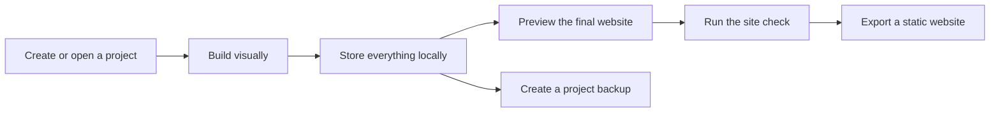
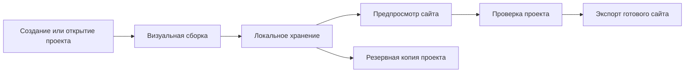

<div align="center">

# ☀️ sunConstructor

### Build visually. Keep everything locally. Export a real website.

**A local-first visual website builder that runs entirely in your browser and lets you design, refine and export complete static websites without accounts, servers or a backend.**

<br>

[**English**](#-english) · [**Русский**](#-русский)

<br>


</div>

<br>

<p align="center">
  
  
  
</p>

<br>

> [!NOTE]
> sunConstructor is designed around a simple principle: the website you are building should belong to you before, during and after editing, which is why the core workflow does not depend on a cloud account, remote project database or proprietary hosting platform.

---

# 🇬🇧 English

## ✦ About sunConstructor

sunConstructor is a visual website builder created for people who want to make a personal website, portfolio, landing page or small-business site without learning specialist design tools, configuring a backend or creating another online account just to begin working. You give the project a name, choose a starting point, build directly on a live canvas, refine the typography, colours, spacing and layout until the result feels like your own, and then keep the editable project on your device or export it as a finished static website that can be uploaded to practically any hosting service.

The entire workflow follows a deliberately **local-first** philosophy, which means that project data, images and editing state remain inside your browser instead of being continuously synchronised with a remote service. The editor is built around the idea that the page you are looking at while designing should remain as close as possible to the page your visitors eventually receive, so editing, previewing and exporting all work from the same underlying structure.

### At a glance

| | |
|---|---|
| 🧩 **Visual building** | Create layouts directly on a live canvas instead of writing page structure by hand. |
| 💾 **Local-first storage** | Keep projects and image assets inside the browser through IndexedDB. |
| 📱 **Responsive editing** | Design desktop, tablet and mobile layouts with breakpoint-specific overrides. |
| 🎨 **Shared design system** | Manage colours, spacing, radii and primary button styling from one place. |
| 📦 **Static export** | Export complete websites as self-contained ZIP archives ready for hosting. |
| 🔒 **No backend required** | The core editor works without a remote database, account system or application server. |

---

## ✦ What version 1.0.0 can do

### 🧱 Start from something useful, or start from nothing

Every new project can begin with one of six complete starting points, and each of them follows a noticeably different visual direction so that websites created with the same builder do not automatically inherit the same personality. You can begin with a completely blank page for a fully manual build, choose the playful **North Coffee** food story, the maximal **Signal Studio** creative portfolio, the art-directed **Mara Vale** personal portfolio, the poster-inspired **After Eight** restaurant page, or the crisp **Relay One** product launch, and every starter remains fully editable once it enters the canvas.

Alongside those complete starting points, sunConstructor includes twelve ready-made sections covering the building blocks that most websites eventually need, including navigation, hero areas, galleries, pricing sections and contact blocks. Anything you create yourself can also be stored as a reusable block, which makes it possible to gradually build your own personal section library instead of recreating familiar layouts for every new project.

### 🖱️ Edit the real page instead of an approximation

The main canvas acts as a true live preview of the website and is rendered inside an isolated frame using the same compiler that powers the final export, which keeps the editing experience and the published result closely aligned instead of maintaining two different interpretations of the same page. Elements can be inserted directly into the currently selected container or dragged precisely before, after or inside another element, while the layers panel mirrors the complete page hierarchy and provides collapsing, renaming, visibility controls, locking and structural movement through its context menu.

Because the document structure remains editable throughout the entire process, layouts can continue evolving even after a project has become complex, while sections, containers and individual elements can be reorganised without forcing you to rebuild the surrounding design simply because the page hierarchy changed halfway through the work.

### 📱 Design responsively from the beginning

Responsive editing is treated as part of the normal design workflow rather than as a final correction step, so the editor can switch between desktop, tablet and mobile viewports while remembering property overrides separately for each breakpoint. Values from larger layouts are inherited wherever a narrower breakpoint does not define its own override, which makes it possible to keep a coherent design system without manually duplicating every property across three different versions of the same page.

Typography is backed by a browsable Google Fonts library with live previews and language filtering, while headings, paragraphs, buttons and other text elements expose controls for weight, size, spacing, alignment and decoration. Individual elements can continue following global project styles or branch into their own local appearance whenever necessary, while those local changes remain resettable without manually reconstructing the original values.

### 🎨 Keep the visual system connected

Project-wide colours, spacing values, corner radii and primary button styling are managed centrally, which makes broad visual changes significantly easier than editing the same values across dozens of individual elements. Background surfaces can use solid colours, gradients or imagery and can be extended with borders, shadows, opacity and blur directly from the inspector, allowing the page to gain depth and atmosphere without moving the work into a separate graphics application.

The design system is intentionally shared without becoming restrictive, so a project can maintain a consistent visual identity while still allowing individual sections and elements to behave differently whenever the composition genuinely needs an exception.

### 💾 Keep projects and assets on your own device

sunConstructor stores project data and image assets locally through **IndexedDB**, which allows the editor to operate without a traditional application backend and keeps the editable project inside the browser by default. Complete websites can be exported as self-contained ZIP archives prepared for static hosting, while dedicated project backup files preserve the editable source and can be imported again whenever you want to continue working, move a project between devices manually or restore an earlier copy.

Multi-page websites are supported with configurable slugs, browser titles, meta descriptions, favicons and social preview images, while the built-in site check can inspect the current project for missing destinations, broken internal links, absent alternative text, duplicate paths and other problems that are easy to miss before publishing.

> [!IMPORTANT]
> Because sunConstructor intentionally keeps projects local, browser storage is part of the project workspace, so creating portable project backups is recommended whenever a website becomes important or contains work that should not exist in only one local copy.

### ⌨️ Keep the workspace out of the way

The editor includes keyboard shortcuts, a command palette, distraction-free preview mode, first-visit guidance and restrained staged entrance animations that help make the interface understandable without turning the workspace into a permanent tutorial. These tools remain secondary to the canvas itself, because the interface is designed to provide additional control when you need it while becoming visually quieter when you are simply shaping the page.

---

## ✦ How it works



sunConstructor does not require a remote project database or permanent application server for its core workflow, because editable project data and assets are persisted locally while the exported result is a conventional static website that can live independently from the builder that created it.

---

## ✦ Technology

<div align="center">

| React | TypeScript | Vite | Zustand | IndexedDB |
|:---:|:---:|:---:|:---:|:---:|
| Interface | Type safety | Tooling & build | Editor state | Local persistence |

</div>

The technical stack stays intentionally compact, because the project does not need a large server architecture to support its core functionality and can instead focus most of its complexity on the editor, compiler, responsive styling system and local project model.

---

## ✦ Run it locally

sunConstructor is built with **Vite**, **React**, **TypeScript** and **Zustand**, so local development only requires a recent Node.js runtime and the usual npm workflow. After cloning the repository, install the dependencies and start the development server with:

```bash
npm install
npm run dev
```

The development server opens the builder locally in your browser, while the production bundle can be generated with:

```bash
npm run build
```

The production build also type-checks the codebase before creating the final bundle, while the lint command can be used during development to keep the code style consistent:

```bash
npm run lint
```

---

## ✦ Project philosophy

sunConstructor is built around the idea that a capable website builder does not necessarily need an account system, permanent cloud workspace or traditional backend in order to be useful. Modern browsers already provide enough technology to store structured projects, manage assets, render complex interfaces and prepare downloadable files, so the project uses those capabilities directly and keeps the resulting workflow understandable, portable and independent from a hosted service.

The editor is also intentionally designed around conventional static output rather than a proprietary runtime, because a finished website should remain useful after it leaves the builder and should not depend on sunConstructor continuing to run somewhere else simply to stay online.

---

## ✦ Author

sunConstructor is created and maintained by **[lordofsunshine](https://github.com/lordofsunshine)** as an experiment in making visual website creation more local, portable and independent from the cloud-first model used by many traditional website builders.

<br>

<div align="center">

**☀️ Built locally. Exported freely. Yours from start to finish.**

[Back to top](#-sunconstructor)

</div>

---

# 🇷🇺 Русский

## ✦ О sunConstructor

sunConstructor представляет собой визуальный конструктор сайтов для тех, кто хочет создать личный сайт, портфолио, лендинг или небольшой сайт для бизнеса без изучения специализированных дизайнерских инструментов, настройки серверной части и регистрации очередного аккаунта только ради начала работы. Вы создаёте проект, выбираете подходящую отправную точку, собираете страницу непосредственно на живом холсте, настраиваете типографику, цвета, отступы и расположение элементов, а затем сохраняете редактируемый проект на своём устройстве или экспортируете готовый статический сайт, который можно разместить практически на любом хостинге.

В основе проекта лежит принцип **local-first**, поэтому данные сайта, изображения и текущее состояние редактора хранятся непосредственно в браузере, а не отправляются на удалённый сервис для постоянной синхронизации. Сам редактор устроен таким образом, чтобы страница во время работы максимально соответствовала тому результату, который впоследствии увидят посетители, поэтому редактирование, предпросмотр и экспорт используют одну и ту же структуру проекта.

### Коротко о главном

| | |
|---|---|
| 🧩 **Визуальная сборка** | Создавайте структуру сайта непосредственно на живом холсте без ручного написания разметки. |
| 💾 **Локальное хранение** | Проекты и изображения сохраняются в браузере через IndexedDB. |
| 📱 **Адаптивный дизайн** | Настраивайте отдельное поведение элементов для компьютеров, планшетов и смартфонов. |
| 🎨 **Единая дизайн-система** | Управляйте цветами, отступами, скруглениями и основными кнопками из одного места. |
| 📦 **Статический экспорт** | Получайте готовый сайт в самостоятельном ZIP-архиве, который можно разместить на хостинге. |
| 🔒 **Без backend** | Основная работа редактора не требует сервера приложений, удалённой базы данных или системы аккаунтов. |

---

## ✦ Возможности версии 1.0.0

### 🧱 Начните с готовой основы или полностью с нуля

Каждый новый проект может начинаться с одного из шести полноценных шаблонов, причём каждый из них построен вокруг заметно отличающегося визуального направления, благодаря чему сайты из одного конструктора не обязаны выглядеть как вариации одного и того же макета. Можно выбрать полностью пустую страницу для самостоятельной сборки, playful-стиль **North Coffee**, максималистичное творческое портфолио **Signal Studio**, художественно выстроенное персональное портфолио **Mara Vale**, постерную страницу вечернего ресторана **After Eight** или лаконичный продуктовый запуск **Relay One**, после чего любой выбранный вариант остаётся полностью редактируемым.

В дополнение к полноценным стартовым проектам sunConstructor содержит двенадцать готовых секций, среди которых навигация, hero-блоки, галереи, блоки с тарифами, контактные секции и другие элементы, которые регулярно встречаются на современных сайтах. Любую созданную вручную секцию также можно сохранить как повторно используемый блок, постепенно формируя собственную библиотеку элементов вместо повторной сборки знакомых конструкций в каждом новом проекте.

### 🖱️ Редактируйте настоящий сайт, а не его приблизительную копию

Основной холст одновременно является полноценным живым предпросмотром сайта и отображается в изолированном фрейме с использованием того же компилятора, который участвует в финальном экспорте, поэтому содержимое редактора и опубликованный результат остаются максимально близкими друг к другу. Элементы можно добавлять непосредственно в выбранный контейнер или точно перетаскивать перед другими элементами, после них или внутрь них, а панель слоёв отражает полную структуру страницы и позволяет сворачивать группы, переименовывать элементы, менять их видимость, блокировать их и перестраивать иерархию через контекстное меню.

Поскольку структура документа остаётся редактируемой на протяжении всей работы, даже сложный макет можно продолжать развивать без необходимости пересобирать окружающие секции только потому, что расположение или вложенность отдельных элементов изменились в процессе создания страницы.

### 📱 Создавайте адаптивный дизайн сразу

Работа с адаптивностью встроена непосредственно в обычный процесс дизайна и не откладывается на финальную стадию, поэтому редактор позволяет переключаться между компьютерным, планшетным и мобильным представлением, одновременно сохраняя отдельные изменения свойств для каждого breakpoint. Значения из более крупного макета наследуются там, где для меньшего экрана не определено собственное значение, благодаря чему можно сохранить единую систему оформления и при этом менять только те свойства, которые действительно должны вести себя иначе на небольших дисплеях.

Типографика работает через библиотеку Google Fonts с живым предпросмотром и фильтрацией по языкам, а заголовки, абзацы, кнопки и другие текстовые элементы предоставляют настройки начертания, размера, интервалов, выравнивания и оформления. Каждый элемент может продолжать использовать глобальные стили проекта или получить собственное локальное оформление, которое при необходимости можно сбросить без ручного восстановления исходных значений.

### 🎨 Управляйте визуальным стилем как единой системой

Цвета проекта, интервалы, радиусы скругления и оформление основной кнопки управляются централизованно, поэтому крупное изменение визуального направления не требует вручную редактировать одинаковые значения в десятках разных элементов. Фоновые поверхности поддерживают однотонные цвета, градиенты и изображения, а непосредственно через инспектор к ним можно добавлять границы, тени, прозрачность и размытие, создавая более выразительную композицию без постоянного перехода в отдельный графический редактор.

Общая дизайн-система помогает сохранять целостность сайта, но при этом не ограничивает отдельные части макета, поэтому конкретная секция или элемент может получить собственное оформление там, где композиции действительно требуется визуальное исключение.

### 💾 Храните проекты и ресурсы на своём устройстве

sunConstructor сохраняет данные проектов и изображения локально через **IndexedDB**, благодаря чему редактор может работать без традиционного backend и по умолчанию оставляет редактируемую версию проекта непосредственно внутри браузера. Полностью готовый сайт можно экспортировать в самостоятельный ZIP-архив для статического хостинга, а отдельный файл резервной копии сохраняет исходный редактируемый проект и позволяет позднее импортировать его обратно, перенести вручную на другое устройство или восстановить предыдущую копию.

Конструктор поддерживает многостраничные сайты с собственными slug, заголовками браузера, meta description, favicon и изображениями для социальных сетей, а встроенная проверка проекта позволяет обнаружить отсутствующие назначения, повреждённые внутренние ссылки, изображения без альтернативного текста, повторяющиеся пути и другие проблемы, которые легко пропустить перед публикацией.

> [!IMPORTANT]
> Поскольку sunConstructor намеренно хранит проекты локально, данные браузера являются частью рабочего пространства, поэтому для важных сайтов рекомендуется периодически создавать переносимые резервные копии проекта и не оставлять единственную рабочую версию только в одном локальном хранилище.

### ⌨️ Сосредоточьтесь на странице, а не на самом редакторе

Рабочее пространство поддерживает горячие клавиши, палитру команд, режим предпросмотра без отвлекающих элементов, подсказки при первом запуске и спокойные поэтапные анимации появления интерфейса, которые помогают быстрее освоиться, не превращая редактор в бесконечный интерактивный учебник. Эти возможности намеренно остаются второстепенными по отношению к самому холсту, чтобы интерфейс давал дополнительный контроль тогда, когда он действительно нужен, и визуально отходил на второй план во время обычной работы над страницей.

---

## ✦ Как всё работает



Для основной работы sunConstructor не требуется удалённая база проектов или постоянно работающий сервер приложения, потому что редактируемые данные и ресурсы сохраняются локально, а результатом экспорта становится обычный статический сайт, который способен существовать независимо от самого конструктора.

---

## ✦ Технологии

<div align="center">

| React | TypeScript | Vite | Zustand | IndexedDB |
|:---:|:---:|:---:|:---:|:---:|
| Интерфейс | Типизация | Сборка | Состояние редактора | Локальное хранение |

</div>

Технический стек намеренно остаётся компактным, поскольку проекту не требуется крупная серверная инфраструктура для реализации основной функциональности, а большая часть сложности сосредоточена в редакторе, компиляторе, системе адаптивных стилей и локальной модели проекта.

---

## ✦ Локальный запуск

sunConstructor разработан на **Vite**, **React**, **TypeScript** и **Zustand**, поэтому для локального запуска разработки достаточно современной версии Node.js и стандартного npm workflow. После клонирования репозитория установите зависимости и запустите development server:

```bash
npm install
npm run dev
```

После запуска локальный редактор откроется в браузере, а production-сборку проекта можно подготовить следующей командой:

```bash
npm run build
```

Во время production-сборки кодовая база также проходит проверку типов, а для контроля единого стиля кода во время разработки можно использовать:

```bash
npm run lint
```

---

## ✦ Философия проекта

sunConstructor развивается вокруг идеи о том, что функциональному визуальному конструктору сайтов необязательно требуются аккаунт пользователя, постоянное облачное рабочее пространство и традиционный backend. Современный браузер уже предоставляет достаточно возможностей для хранения структурированных проектов, управления ресурсами, отображения сложного интерфейса и подготовки файлов для экспорта, поэтому проект использует эти возможности напрямую и сохраняет рабочий процесс понятным, переносимым и независимым от удалённого сервиса.

Готовый сайт также намеренно экспортируется в обычном статическом формате вместо использования закрытого runtime, поскольку результат работы должен продолжать существовать независимо от конструктора и не должен требовать работающего sunConstructor только для того, чтобы оставаться доступным в интернете.

---

## ✦ Автор

sunConstructor создаётся и поддерживается **[lordofsunshine](https://github.com/lordofsunshine)** как проект, исследующий более локальный, переносимый и независимый подход к визуальному созданию сайтов без обязательной привязки к традиционной cloud-first модели.

<br>

<div align="center">

**☀️ Создан локально. Экспортирован свободно. Принадлежит вам от начала до конца.**

[Наверх](#-sunconstructor)

</div>